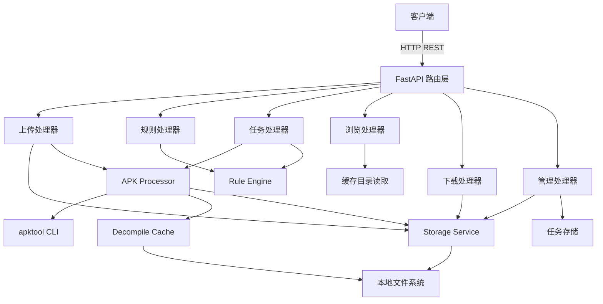
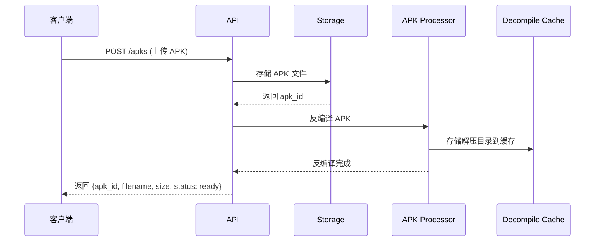
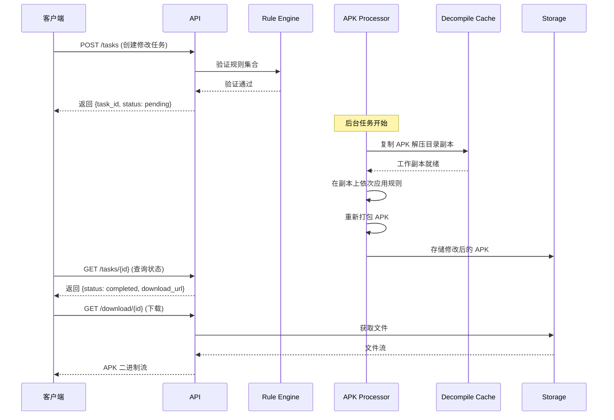
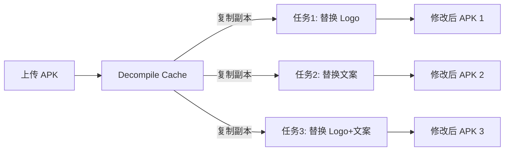

# 设计文档：APK 修改工具后端服务

## 概述

本系统是一个基于 Python + FastAPI 的后端 RESTful 服务，提供 APK 文件的上传、自动解压缓存、内容浏览、规则定义、自动修改和下载功能。核心优化点是"一次上传，多次修改下载"：APK 上传时立即使用 `apktool` 反编译并缓存解压目录，后续每次修改任务从缓存复制副本进行操作，避免重复解压的开销。

### 技术选型

- **语言**: Python 3.11+
- **Web 框架**: FastAPI（高性能异步框架，自动生成 OpenAPI 文档）
- **APK 处理**: apktool（反编译/重新打包）
- **任务处理**: asyncio + 后台任务（FastAPI BackgroundTasks）
- **存储**: 本地文件系统 + 静态文件服务
- **数据模型**: Pydantic v2
- **测试**: pytest + hypothesis（属性测试）

## 架构



### 上传与缓存流程



### 修改任务流程（基于缓存）



### 一次上传多次修改示意



## 组件与接口

### API 路由设计

| 方法 | 路径 | 描述 | 请求体 | 响应 |
|------|------|------|--------|------|
| POST | `/api/v1/apks` | 上传 APK 文件（同步解压缓存） | multipart/form-data | `{apk_id, filename, size, status}` |
| GET | `/api/v1/apks` | 获取已上传 APK 列表 | - | `{apks: APKInfo[]}` |
| DELETE | `/api/v1/apks/{apk_id}` | 删除 APK 及其缓存和关联任务产物 | - | `{success: bool}` |
| GET | `/api/v1/apks/{apk_id}/files` | 浏览 APK 文件结构（从缓存读取） | - | `{files: FileNode[]}` |
| GET | `/api/v1/apks/{apk_id}/files/{path}` | 查看脚本文件内容（从缓存读取） | - | `{content: string}` |
| GET | `/api/v1/apks/{apk_id}/tasks` | 获取 APK 关联的任务列表 | - | `{tasks: TaskSummary[]}` |
| POST | `/api/v1/tasks` | 创建修改任务（从缓存复制副本） | `CreateTaskRequest` | `{task_id, status}` |
| GET | `/api/v1/tasks/{task_id}` | 查询任务状态 | - | `TaskResponse` |
| GET | `/api/v1/download/{task_id}` | 下载修改后的 APK | - | binary stream |

### 核心组件接口

```python
# storage_service.py
class StorageService:
    async def save_upload(self, file: UploadFile) -> str:
        """保存上传的 APK 文件，返回 apk_id"""
        ...

    def get_apk_path(self, apk_id: str) -> Path:
        """获取原始 APK 文件的本地路径"""
        ...

    def get_cache_dir(self, apk_id: str) -> Path:
        """获取 APK 解压缓存目录路径"""
        ...

    def get_work_dir(self, task_id: str) -> Path:
        """获取任务工作副本目录路径"""
        ...

    def get_output_path(self, task_id: str) -> Path:
        """获取修改后 APK 的输出路径"""
        ...

    def file_exists(self, path: Path) -> bool:
        """检查文件是否存在"""
        ...

    async def delete_apk(self, apk_id: str, task_ids: list[str]) -> None:
        """删除 APK 文件、缓存目录及关联任务产物"""
        ...

    def list_apks(self) -> list[dict]:
        """列出所有已上传的 APK 信息"""
        ...


# rule_engine.py
class RuleEngine:
    def validate_rules(self, rules: list[ReplacementRule]) -> ValidationResult:
        """验证规则集合，返回每条规则的验证结果"""
        ...

    def apply_script_rule(self, base_dir: Path, rule: ScriptRule) -> RuleResult:
        """在工作副本目录中执行脚本替换规则"""
        ...

    def apply_image_rule(self, base_dir: Path, rule: ImageRule) -> RuleResult:
        """在工作副本目录中执行图片替换规则"""
        ...

# apk_processor.py
class APKProcessor:
    async def decompile_to_cache(self, apk_path: Path, cache_dir: Path) -> None:
        """使用 apktool 反编译 APK 到缓存目录（上传时调用）"""
        ...

    async def copy_cache_to_workdir(self, cache_dir: Path, work_dir: Path) -> None:
        """从缓存目录复制一份工作副本（创建任务时调用）"""
        ...

    async def recompile(self, source_dir: Path, output_apk: Path) -> None:
        """使用 apktool 重新打包 APK"""
        ...

    def list_files_from_cache(self, cache_dir: Path) -> list[FileNode]:
        """从缓存目录读取文件结构，构建 FileNode 树"""
        ...

    def read_file_from_cache(self, cache_dir: Path, internal_path: str) -> str:
        """从缓存目录读取指定文件的文本内容"""
        ...

    async def process_task(self, task: Task) -> TaskResult:
        """执行完整的修改任务：复制缓存 → 应用规则 → 重新打包"""
        ...
```

## 数据模型

```python
from pydantic import BaseModel, Field
from enum import Enum
from typing import Union
from datetime import datetime

# === 规则模型 ===

class RuleType(str, Enum):
    SCRIPT = "script"
    IMAGE = "image"

class ScriptRule(BaseModel):
    """脚本替换规则"""
    type: RuleType = RuleType.SCRIPT
    target_path: str = Field(..., description="APK 内目标脚本文件路径")
    pattern: str = Field(..., description="匹配模式（支持正则表达式）")
    replacement: str = Field(..., description="替换文本")
    use_regex: bool = Field(default=False, description="是否使用正则表达式匹配")

class ImageRule(BaseModel):
    """图片替换规则"""
    type: RuleType = RuleType.IMAGE
    target_path: str = Field(..., description="APK 内目标图片文件路径")
    image_data: str = Field(..., description="替换图片的 Base64 编码数据")

ReplacementRule = Union[ScriptRule, ImageRule]

# === 任务模型 ===

class TaskStatus(str, Enum):
    PENDING = "pending"
    PROCESSING = "processing"
    COMPLETED = "completed"
    FAILED = "failed"

class RuleResult(BaseModel):
    """单条规则的执行结果"""
    rule_index: int
    success: bool
    message: str

class CreateTaskRequest(BaseModel):
    """创建修改任务的请求"""
    apk_id: str
    rules: list[Union[ScriptRule, ImageRule]]

class TaskResponse(BaseModel):
    """任务状态响应"""
    task_id: str
    apk_id: str
    status: TaskStatus
    created_at: datetime
    completed_at: datetime | None = None
    download_url: str | None = None
    rule_results: list[RuleResult] = []
    error: str | None = None

class TaskSummary(BaseModel):
    """任务摘要（用于列表展示）"""
    task_id: str
    status: TaskStatus
    created_at: datetime
    completed_at: datetime | None = None

# === 文件浏览模型 ===

class FileNode(BaseModel):
    """文件树节点"""
    name: str
    path: str
    is_directory: bool
    children: list["FileNode"] = []
    size: int | None = None

# === APK 模型 ===

class CacheStatus(str, Enum):
    DECOMPILING = "decompiling"
    READY = "ready"
    FAILED = "failed"

class APKUploadResponse(BaseModel):
    """APK 上传响应"""
    apk_id: str
    filename: str
    size: int
    cache_status: CacheStatus

class APKInfo(BaseModel):
    """已上传 APK 信息"""
    apk_id: str
    filename: str
    size: int
    uploaded_at: datetime
    cache_status: CacheStatus
    task_count: int

# === 规则验证结果 ===

class ValidationError(BaseModel):
    """单条规则的验证错误"""
    rule_index: int
    field: str
    message: str

class ValidationResult(BaseModel):
    """规则集合的验证结果"""
    valid: bool
    errors: list[ValidationError] = []
```

### 存储目录结构

```
data/
├── uploads/              # 上传的原始 APK
│   └── {apk_id}.apk
├── cache/                # 解压缓存目录（上传时创建，长期保留）
│   └── {apk_id}/
│       └── decompiled/   # apktool 反编译输出
├── workspace/            # 任务工作副本（从缓存复制，任务完成后可清理）
│   └── {task_id}/
│       └── decompiled/
├── output/               # 修改后的 APK
│   └── {task_id}.apk
└── images/               # 上传的替换图片（临时）
    └── {uuid}.png
```

### 缓存与工作副本的关系

- `cache/{apk_id}/` 是上传时一次性反编译的结果，作为只读模板长期保留
- `workspace/{task_id}/` 是每次创建任务时从缓存复制的工作副本，任务完成后可清理
- 多个任务可以同时从同一个缓存目录复制副本，互不干扰


## 正确性属性

*正确性属性是一种在系统所有有效执行中都应成立的特征或行为——本质上是关于系统应该做什么的形式化陈述。属性作为人类可读规范和机器可验证正确性保证之间的桥梁。*

### Property 1: 上传往返一致性

*For any* 有效的 APK 文件，上传到系统后，使用返回的 apk_id 应能从 Storage_Service 中检索到与原始文件内容完全一致的文件。

**Validates: Requirements 1.1**

### Property 2: 无效文件拒绝

*For any* 非 APK 格式的二进制数据，上传到系统时应被拒绝并返回 400 状态码，且不会在存储中留下任何文件。

**Validates: Requirements 1.3**

### Property 3: 有效规则验证通过

*For any* 格式正确的 ReplacementRule（ScriptRule 或 ImageRule），其 target_path 非空且格式有效时，Rule_Engine 的验证结果应为通过。

**Validates: Requirements 2.1, 2.2**

### Property 4: 无效规则路径拒绝

*For any* target_path 为空字符串或包含非法字符（如 `..` 路径遍历）的 ReplacementRule，Rule_Engine 的验证结果应为失败，且错误信息中应包含具体的字段名和失败原因。

**Validates: Requirements 2.3**

### Property 5: 批量验证完整性

*For any* 包含 N 条规则的规则集合，Rule_Engine 的验证结果应恰好包含对每条无效规则的错误记录，且有效规则不产生错误记录。验证结果的 valid 字段应等于所有规则均通过验证。

**Validates: Requirements 2.4**

### Property 6: 脚本替换正确性

*For any* 包含匹配文本的文件内容和有效的 ScriptRule（无论 use_regex 为 True 或 False），执行替换后，结果文件中所有匹配 pattern 的文本应被替换为 replacement 文本，且文件中非匹配部分应保持不变。

**Validates: Requirements 2.5, 3.2**

### Property 7: 图片替换正确性

*For any* 目录中存在目标文件的 ImageRule，执行替换后，目标路径的文件内容应与 image_data 解码后的二进制数据完全一致。

**Validates: Requirements 3.3**

### Property 8: 缓存不可变性

*For any* 已上传并缓存的 APK，在对其执行一个或多个修改任务后，Decompile_Cache 中该 APK 的解压目录内容应与任务执行前完全一致（文件列表和每个文件的内容均不变）。

**Validates: Requirements 3.1, 3.7**

### Property 9: 任务状态响应一致性

*For any* Task 对象，当 status 为 completed 时，download_url 和 rule_results 字段不为空；当 status 为 failed 时，error 字段不为空；当 status 为 pending 或 processing 时，download_url 为空。

**Validates: Requirements 4.1, 4.2, 4.3**

### Property 10: 下载 URL 唯一性

*For any* 两个不同的 task_id，Storage_Service 生成的下载 URL 应互不相同。

**Validates: Requirements 5.3**

### Property 11: 缓存文件读取准确性

*For any* 已缓存的 APK 和其中存在的文件路径，从 Decompile_Cache 读取的文件树结构应与缓存目录的实际文件系统结构一致，读取的文件内容应与磁盘上的文件内容一致。

**Validates: Requirements 6.1, 6.2**

### Property 12: 规则序列化往返一致性

*For any* 有效的 ReplacementRule 对象（ScriptRule 或 ImageRule），将其序列化为 JSON 再反序列化后，应产生与原始对象等价的结果。

**Validates: Requirements 7.3**

### Property 13: APK 列表完整性

*For any* 已上传的 N 个 APK 文件，查询 APK 列表应返回恰好 N 条记录，且每条记录包含正确的 apk_id、文件名和缓存状态。

**Validates: Requirements 8.1**

### Property 14: APK 关联任务列表完整性

*For any* 已上传的 APK 及其关联的 M 个修改任务，查询该 APK 的任务列表应返回恰好 M 条任务摘要记录。

**Validates: Requirements 8.2**

### Property 15: APK 删除完整性

*For any* 已上传的 APK，执行删除操作后，原始 APK 文件、Decompile_Cache 中的解压目录以及所有关联的修改后 APK 文件均应从文件系统中移除。

**Validates: Requirements 8.3**

## 错误处理

### 错误响应格式

所有错误响应使用统一的 JSON 格式：

```json
{
  "error": {
    "code": "INVALID_APK_FORMAT",
    "message": "上传的文件不是有效的 APK 格式",
    "details": {}
  }
}
```

### 错误码定义

| HTTP 状态码 | 错误码 | 场景 |
|-------------|--------|------|
| 400 | `INVALID_APK_FORMAT` | 上传文件非 APK 格式 |
| 400 | `INVALID_RULE` | 规则格式验证失败 |
| 404 | `APK_NOT_FOUND` | 指定的 APK ID 不存在 |
| 404 | `TASK_NOT_FOUND` | 指定的任务 ID 不存在 |
| 404 | `FILE_NOT_FOUND` | APK 内部文件路径不存在 |
| 404 | `DOWNLOAD_NOT_FOUND` | 下载文件不存在或已过期 |
| 409 | `CACHE_NOT_READY` | APK 缓存尚未就绪（仍在反编译中） |
| 413 | `FILE_TOO_LARGE` | 文件超过大小限制 |
| 500 | `DECOMPILE_ERROR` | APK 反编译失败 |
| 500 | `PROCESSING_ERROR` | APK 处理过程中发生错误 |
| 500 | `STORAGE_ERROR` | 存储操作失败 |

### 错误处理策略

- **APK 反编译失败**: 删除已存储的 APK 文件，清理临时数据，返回 500 错误（需求 1.6）
- **APK 处理失败**: 任务标记为 failed，记录详细错误信息，清理工作副本（需求 3.6）
- **单条规则执行失败**: 记录失败结果，继续执行剩余规则（需求 3.4）
- **上传中断**: 清理临时文件，返回错误响应（需求 1.5）
- **缓存未就绪**: 创建任务时检查缓存状态，未就绪时返回 409（需求 3.1 前置条件）
- **路径遍历攻击**: 验证所有文件路径不包含 `..` 或绝对路径，防止目录遍历

## 测试策略

### 双重测试方法

本项目采用单元测试和属性测试相结合的方式确保代码正确性：

- **单元测试 (pytest)**: 验证具体示例、边界情况和错误条件
- **属性测试 (hypothesis)**: 验证跨所有输入的通用属性

### 属性测试配置

- **测试库**: hypothesis（Python 属性测试库）
- **最小迭代次数**: 每个属性测试至少 100 次迭代
- **标注格式**: 每个测试用注释引用设计文档中的属性编号
  - 格式: `# Feature: apk-modifier-tool, Property {number}: {property_text}`

### 测试分层

| 层级 | 测试类型 | 覆盖范围 |
|------|----------|----------|
| 数据模型层 | 属性测试 | 规则序列化往返（Property 12）、规则验证（Property 3-5） |
| 规则引擎层 | 属性测试 + 单元测试 | 脚本替换（Property 6）、图片替换（Property 7） |
| 存储层 | 属性测试 + 单元测试 | 上传往返（Property 1）、URL 唯一性（Property 10）、删除完整性（Property 15） |
| 缓存层 | 属性测试 + 单元测试 | 缓存不可变性（Property 8）、缓存读取准确性（Property 11） |
| API 层 | 单元测试 | 错误响应格式、HTTP 状态码、请求验证 |
| 集成层 | 单元测试 | 任务状态一致性（Property 9）、APK 列表（Property 13-14）、端到端流程 |

### 单元测试重点

- 具体的 APK 文件上传和下载流程
- 错误响应格式和 HTTP 状态码
- 边界情况：空规则集、超大文件、不存在的路径、缓存未就绪
- API 路由的请求/响应验证
- 反编译失败时的清理逻辑
- 并发任务创建时的隔离性
